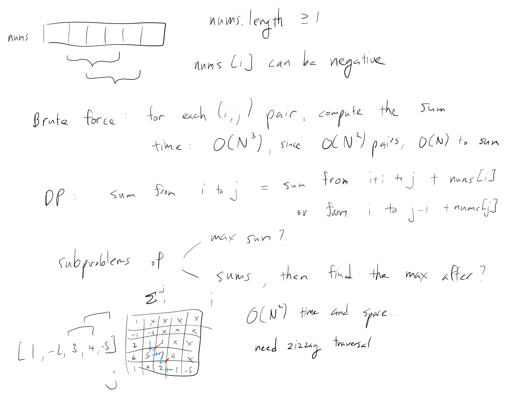
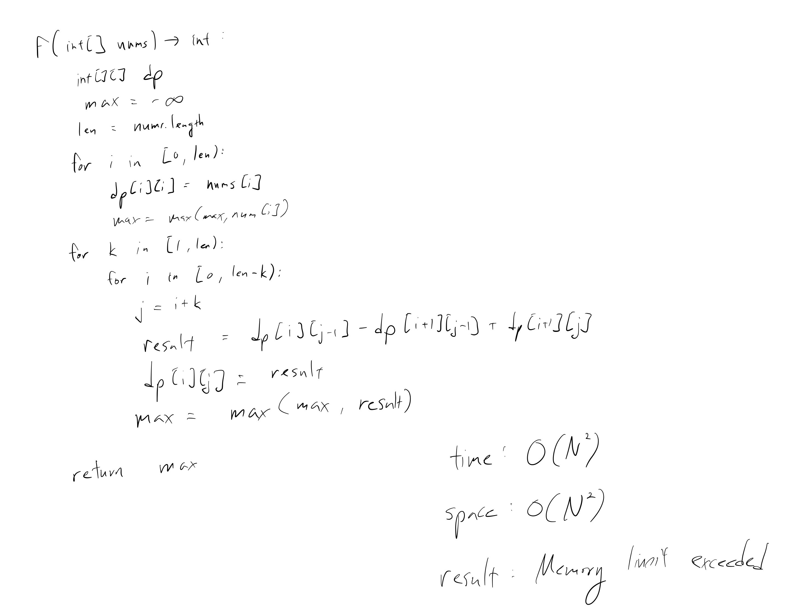

[Problem](https://leetcode.com/problems/maximum-subarray/)

## takeaway
- There are multiple ways to divide a DP problem into subproblems, where some
  are better than others.
- Be careful with edge cases, e.g. null input, input of size 1, etc.

## take 1
- code:


```java
public int maxSubArray(int[] nums) {
    int len = nums.length;
    int[][] dp = new int[len][len]; // sum between indices i and j
    int max = Integer.MIN_VALUE;
    for (int i = 0; i < len; i++) {
        int result = nums[i];
        dp[i][i] = result;
        max = Math.max(max, result);
    }
    for (int k = 1; k < len; k++) {
        for (int i = 0; i < len - k; i++) {
            int j = i + k;
            int result = dp[i][j - 1] - dp[i + 1][j - 1] + dp[i + 1][j];
            dp[i][j] = result;
            max = Math.max(max, result);
        }
    }
    return max;
}
```
- Result
    - Memory Limit Exceeded

## take 2

- code:
```java
public int maxSubArray(int[] nums) {
    int len = nums.length;
    int prev = nums[len - 1]; // last element
    int max = prev;
    for (int i = len - 2; i >= 0; i--) { // starting at second to last element
        int curr = nums[i];
        if (prev > 0) {
            curr += prev;
        }
        prev = curr;
        max = Math.max(max, curr);
    }
    return max;
}
```
- Result
    - Accepted
- Note
    - it's also possible to reverse the subproblem to solve for the max sum
      including the element at index `i` as the tail element of the subarray

