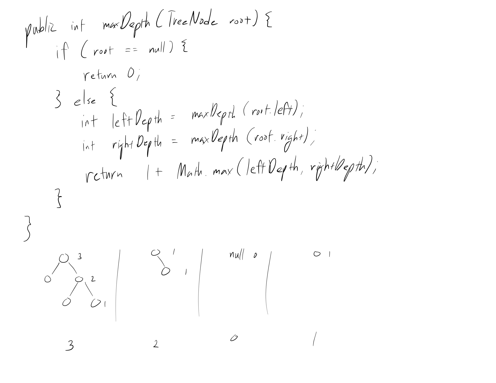

[Problem](https://leetcode.com/problems/maximum-depth-of-binary-tree/)

## takeaway
- The problem itself is easy, but look at the time, space complexity analysis.



## take 1
- the max depth of a binary tree is 1 + that of the deeper child
- submission:
```java
public int maxDepth(TreeNode root) {
    if (root == null) {
        return 0;
    } else {
        int leftDepth = maxDepth(root.left);
        int rightDepth = maxDepth(root.right);
        return 1 + Math.max(leftDepth, rightDepth);
    }
}
```
- Time
    - O(V), where V is the number of nodes in the binary tree, because all
      nodes have to be visited
- Space
    - average case: O(log V), because the number of stack frames used at the
      time is roughly equal to the depth of the binary tree
    - worst case: O(V), because in the case of a extremely skewed binary tree,
      i.e. a linked list, O(V) stack frames will be open at max
- Result
    - Accepted

